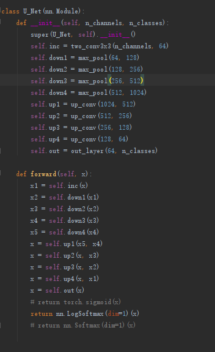

# Unet: implementation of color cell image segmentation method, using pytorch

The architecture was inspired by [U-Net: Convolutional Networks for Biomedical Image Segmentation](http://lmb.informatik.uni-freiburg.de/people/ronneber/u-net/).

---

## Overview

### Data

Source of data: Confidential.
You can find a few files in the folder membrane, which is necessary for confidentiality, so you can't provide too much image data. I hope you understand it, I am very sorry.

### Model

This deep neural network is implemented with pytorch.

### Training

The model (Iteration 100 times) Using RTX 2080 Ti, it takes dozens of minutes to train 40 pictures. If the GPU is not good, the amount of data will be slow.

---

## How to use

### Dependencies

Library from: pytorch
In addition, this code should be compatible with Python version 2.7-3.6.
Remember that you need to download CUDA and pytorch-GPU.
If you want to use the CPU for training and testing, you can modify a small part of the code, but the training will take a long time.

### Run train.py

You will see the prediction results of the test image in u-net/result

### Results

Use the trained model to do segmentation on test images, the result is statisfactory.

## Training completed, how to test directly?

After the training is completed, the corresponding test is directly carried out.
After the training is completed, the UNet_weights_bilinear_weight.pth file is produced. This file is already a well-trained model. You only need to run the test.py file directly.
If you don't want to train for a long time, you need this file, you can contact me: YANGWENYING520@Gmail.com
