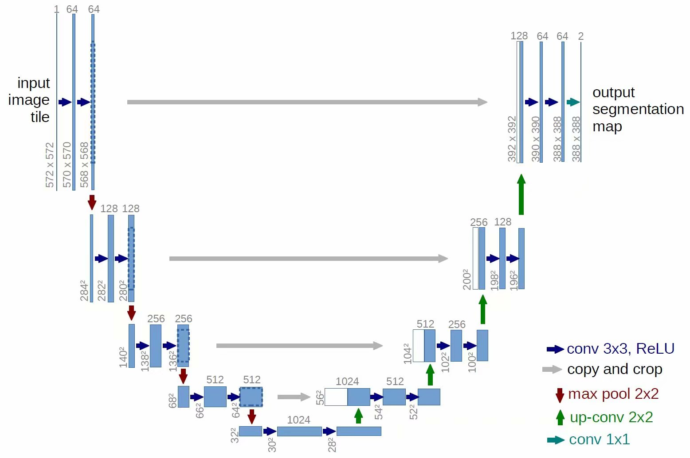
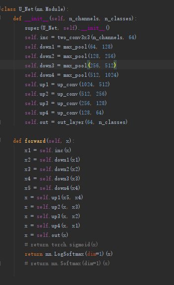
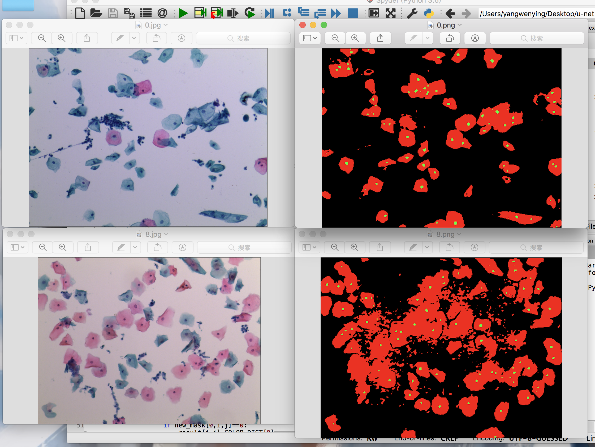

# Unet: implementation of color cell image segmentation method, using pytorch

The architecture was inspired by [U-Net: Convolutional Networks for Biomedical Image Segmentation](http://lmb.informatik.uni-freiburg.de/people/ronneber/u-net/).

---

## Overview

### Data

Source of data: Confidential.
You can find a few files in the folder membrane, which is necessary for confidentiality, so you can't provide too much image data. I hope you understand it, I am very sorry.

### Model

This deep neural network is implemented with pytorch.

### Training

The model (Iteration 100 times) Using RTX 2080 Ti, it takes dozens of minutes to train 40 pictures. If the GPU is not good, the amount of data will be slow.

---

## How to use

### Dependencies

Library from: pytorch
In addition, this code should be compatible with Python version 2.7-3.6.

### Run train.py

You will see the prediction results of the test image in u-net/result

### Results

Use the trained model to do segmentation on test images, the result is statisfactory.

## Direct testing, no need for long training

Direct testing, no need for long training
You don't need training, you can directly test accordingly.
I provide the UNet_weights_bilinear_weight.pth file, which is already a trained model and I hope it will be useful to you.
You only need to run the test.py file directly.
